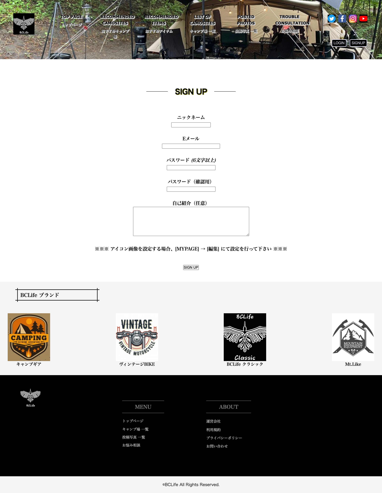
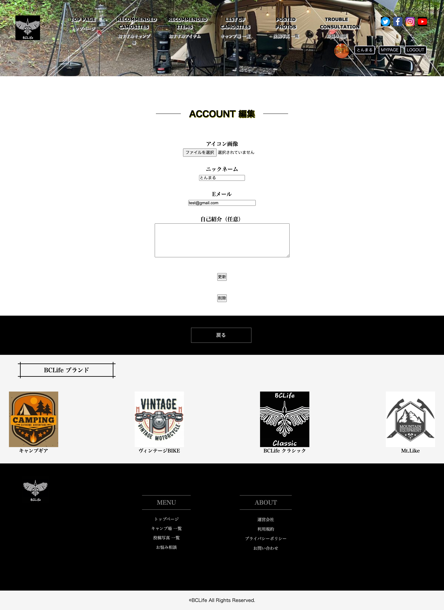
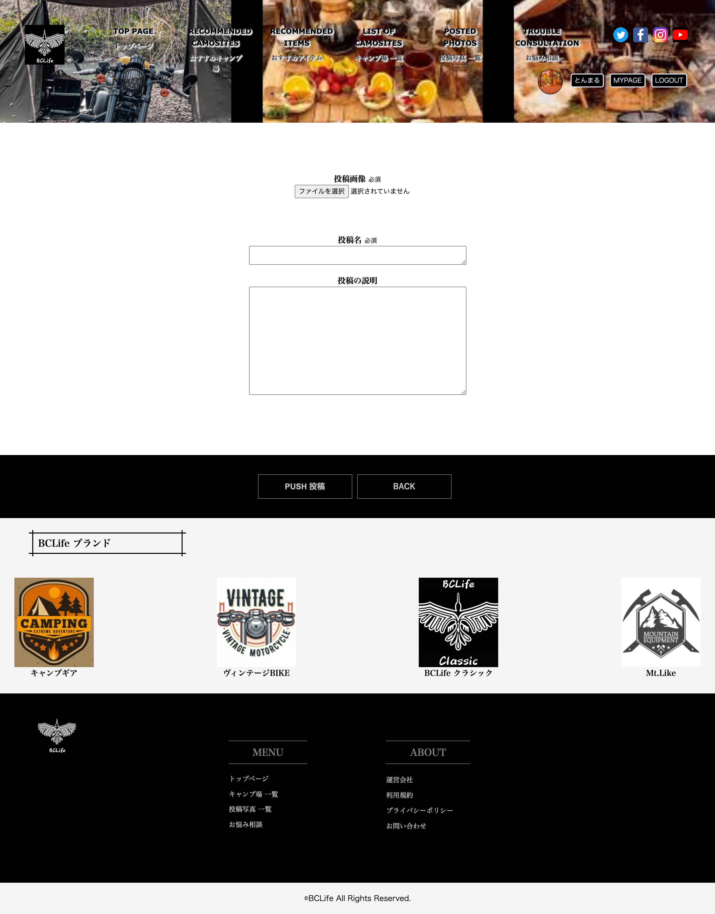
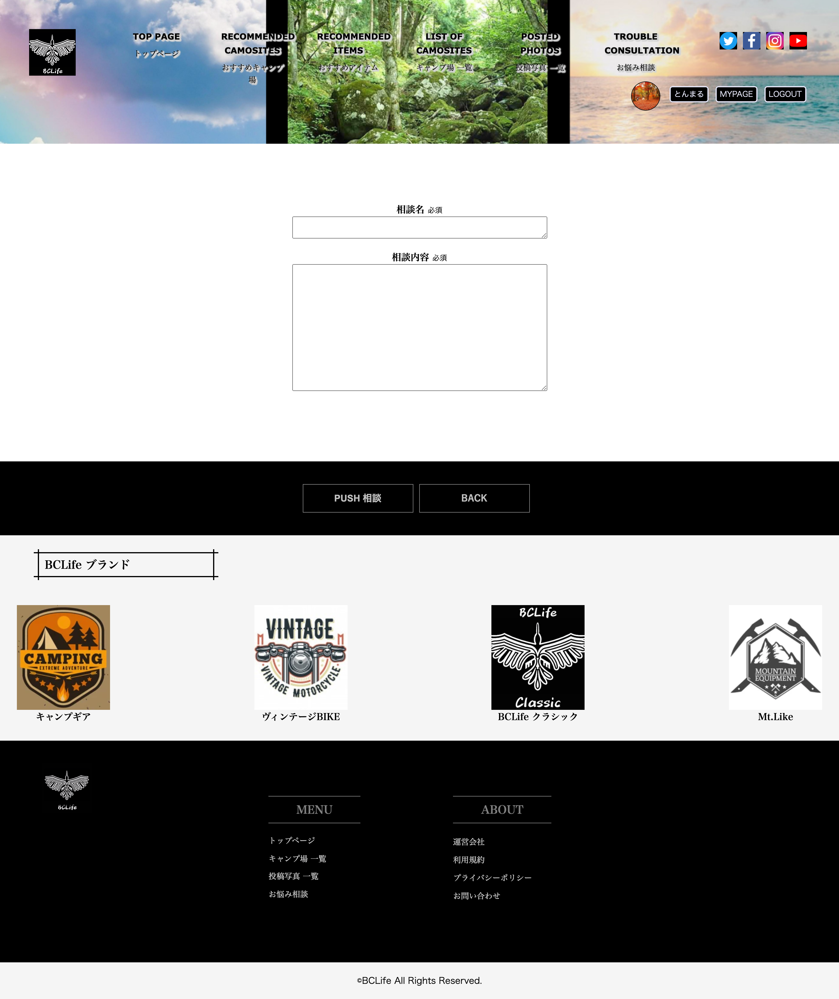
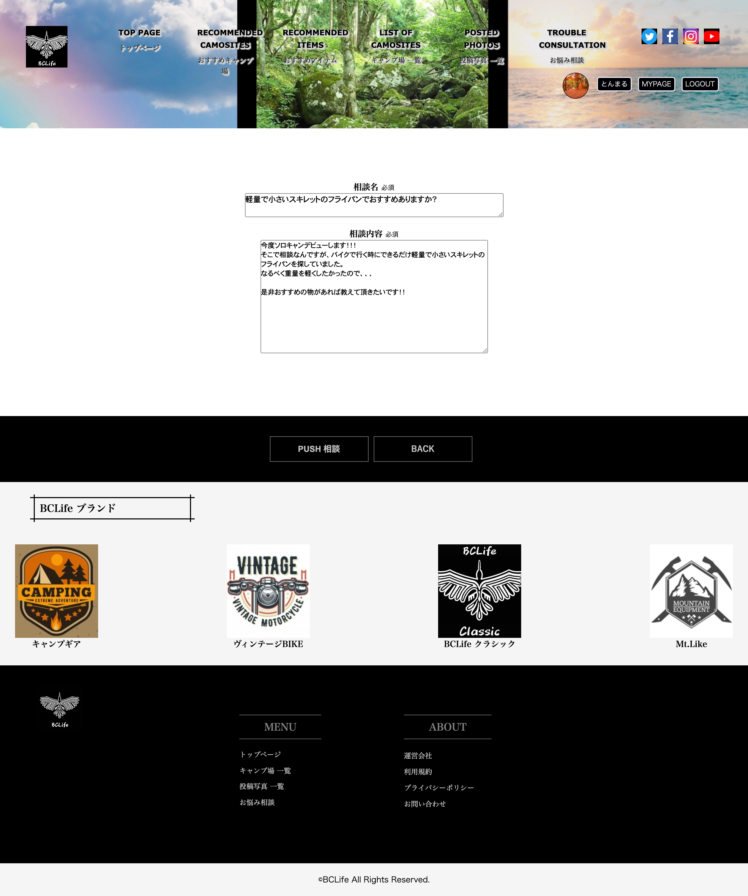
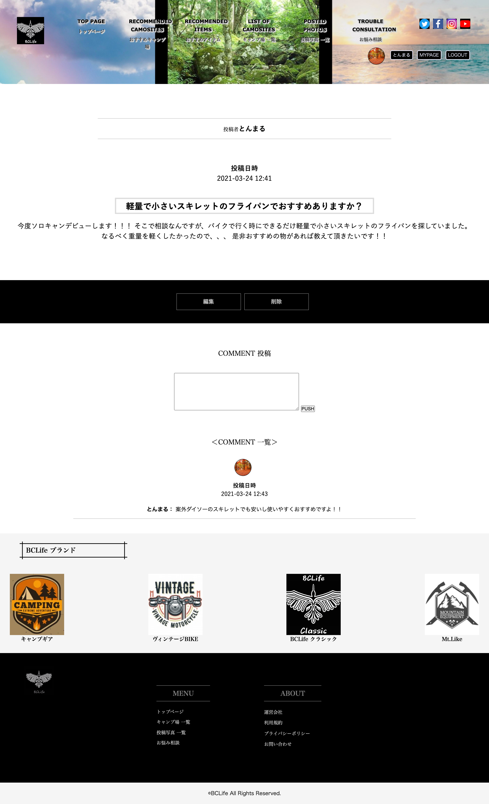

 
 
<!-- START doctoc -->
<!-- END doctoc -->

**目次**

- [アプリ名](#アプリ名)

- [概要](#概要)

- [開発状況](#開発状況)

- [本番環境](#本番環境)

- [制作背景(意図)](#制作背景意図)

- [利用方法](#利用方法)

- [DEMO](#DEMO)
  - [トップページ(おすすめキャンプ場一覧・おすすめアイテム一覧)](#トップページおすすめキャンプ場一覧・おすすめアイテム一覧)
  - [おすすめキャンプ場詳細](#おすすめキャンプ場詳細)
  - [おすすめアイテム詳細](#おすすめアイテム詳細)
  - [新規登録画面](#新規登録画面)
  - [編集・削除画面](#編集・削除画面)
  - [詳細画面(マイページ)](#詳細画面マイページ)
  - [キャンプ場一覧](#キャンプ場一覧)
  - [投稿写真一覧](#投稿写真一覧)
  - [新規投稿画面(写真)](#新規投稿画面写真)
  - [編集画面(写真)](#編集画面写真)
  - [詳細・コメント・削除画面(写真)](#詳細・コメント・削除画面写真)
  - [お悩み相談一覧](#お悩み相談一覧)
  - [新規投稿画面(相談)](#新規投稿画面相談)
  - [編集画面(相談)](#編集画面相談)
  - [詳細・コメント・削除画面(相談)](#詳細・コメント・削除画面相談)

- [工夫したポイント](#工夫したポイント)

- [使用技術(開発環境)](#使用技術開発環境)

- [テストコード](#テストコード)

- [課題や今後実装したい機能](#課題や今後実装したい機能)

- [DB設計](#DB設計)

 
 

# アプリ名

## BCLife (Biker Camper of Life)
 
 

# 概要
バイカー且キャンパーがより充実したライフスタイルを送れるための情報発信サイトです。 
各キャンプ場の詳細や各キャンプ場の公式HPに遷移できるようリンクを挿入しています。 
バイカー且キャンパーのおすすめキャンプ場やおすすめアイテム等の紹介も行っています。 
他、写真投稿や相談投稿もできるようになっていて、バイカー且キャンパーのロマンや充実度を上げるため、不安の解消などもできるアプリケーションの作成をしました。 
 
 

# 開発状況
- 開発期間と平均作業時間
開発期間 : 3/1~3/22 (22日間) 
1日あたりの平均作業時間 : 9 
合計：198時間程度
 
 

# 本番環境
http://13.58.25.124/

テスト情報(テスト用アカウント)

- Eメール : test@gmail.com
- パスワード : tmw989

Basic認証

- ID : test
- Pass : 1111
 
 

# 制作背景(意図)
私の趣味であるバイク・キャンプに関する単体の情報サービスは多くありますが、この2つが結び付き且、特化しているサイトに今まで出会えた事がありませんでした。私自身がバイクに乗りキャンプに行くことは多々あるのですが、実際キャンプ場にいってみたら、キャンプサイトとバイクの駐車場が離れていたという経験がありました。リサーチを行なったところ、バイカーからするとキャンプに行った際には、テントの横にバイクを置き、安心感や充実さ、ロマンを求めたいと言うニーズがありました。そこで、そういった方に対して、バイカーでも安心のキャンプ場マッチングサービスを作成したいと考えたのがこのアプリケーションの制作背景となります。
 
 

# 利用方法
- トップページではバイク・キャンプに関するおすすめ情報が記載されていて、詳細ページに遷移するとより詳細な情報を記載してあります。そこで、ユーザーが求めている情報を提供して、今後の参考になるような情報提供を行っています。
- キャンプ場一覧ページではバイクでいけるキャンプ場のみ紹介しており、住所・電話番号・地図・各キャンプ場の公式HPにアクセスできるようにして、このアプリケーションの核となる情報提供を行っています。バイカーの皆様がテントの横にバイクを駐車できる安心感を提供するため、このページでその不安を払拭して頂けるように作成しました。
- 写真投稿ページでは、愛車のバイクやキャンプ道具、アウトドアで行った際の絶景ポイントやロマン溢れる写真等を自由な投稿をして頂けるページとなっています。自身で使用して気に入ったアイテムの情報をシェアしたり、愛車のバイク自慢等でシェアができる事で、よりユーザー同士の活性化を意図として作成したページとなります。投稿詳細ページではいいね機能も導入して、より充実生を意識しています。
- 相談投稿ページでは、バイカー且キャンパーのコアな悩みを投稿できるようなページとなっています。例えば「バイクでキャンプ行く際に、大きすぎず軽量でコンパクトな寝具のおすすめはありますか？」等のバイカー且キャンパーだからこその抱えているお悩みをユーザー同士で解決できるような形となっています。他アプリケーションで相談サイト行っているサイトもありますが、ここまでコアに絞ったサイトは今まで私が見た事なかったため実装したページとなっております。とはいいつつも、述べたお悩み以外でもアウトドアに関するお悩み相談でも問題はないです。
- マイページでは自身が投稿した、写真・相談が一覧で見れるように実装しています。投稿日時も記載してあるので、自身の振り返りや思い出に浸ったりと、より充実度を上げるため実装しました。アイコン画像も添付できるようにしてあるので、オリジナリティあるマイページを作成できるようになっています。
 
 

# DEMO

### トップページ(おすすめキャンプ場一覧・おすすめアイテム一覧)

 
 

- トップページには「おすすめキャンプ場」「おすすめアイテム」が表示してあります。 
スクロールを行い表示もできますが、ヘッダーメニューバーからも遷移できるよう設定してあります。
- 「おすすめキャンプ場」「おすすめアイテム」各項目をクリックすると詳細ページに遷移できるようになっています。
- ページ上部には「BCLifeサイトについて」の定義をしており、どんなサイトなのかを一目でわかるようしてあります。
 
 
 

### おすすめキャンプ場詳細

 
 

- 詳細ページでは、キャンプ場の写真やポイント・おすすめスポットを表示してあります。 
情報提供を行うページとなっています。
- キャンプ場名をクリックすると、公式HPに別タブで遷移できるようになっており、私のアプリを見てから再度調べ直す手間を無くしています。
 
 
 

### おすすめアイテム詳細

 
 

- 詳細ページでは、紹介しているアイテムの写真や詳細情報・ポイントを表示してあります。 
情報提供を行うページとなっています。
- ページ下部にamazonリンクを挿入してあり、クリックするとamazonの購入ページへ別タブで遷移にできるよう設定してあります。
 
 
 

### 新規登録画面

 
 

- 新規登録では、ニックネーム・Eメール・パスワード・パスワード(確認用)を入力すると新規登録ができるようになっています。
- 自己紹介の項目は任意なので、記述しなくても登録が行えるようになっています。
 
 
 

### 編集・削除画面

 
 

- 編集では、ユーザー情報の編集ができます。 
パスワードの再度入力が手間になると思いましたので、パスワード蘭は表示しておません。 
パスワードの更新なしで他情報を編集できます。
- アイコン画像の設定もできるようになっていて、ファイル選択からご自身のお気に入り画像をアイコンとして使用して頂けます。
 
 
 

### 詳細画面(マイページ)

 
 

- MYPAGEではページ上部に、ご自身のニックネーム・自己紹介・アイコン画像が表示されるようになっています。
- 下にスクロールすると、ご自身が投稿した「写真」「相談」が一覧表示されており、振り返ることや投稿したものの確認ができるようになっています。
- 投稿してあるものをクリックすると、詳細ページに飛べるようになっていて編集や削除も行えます。
 
 
 

### キャンプ場一覧

 
 

- キャンプ場一覧ページでは、神奈川県全てのバイクでいけるキャンプ場を掲載してあります。 
キャンプ場名・住所・電話番号・地図が掲載してある情報ページとなっています。
- ページ上部には「キャンプ場について」の項目を入れて、一言でどんなページなのかをわかるようにしています。
- キャンプ場名をクリックすると、各キャンプ場の公式HPに別タブで遷移できるようになっており、私のアプリを見てから再度調べ直す手間を無くしています。 
 
 
 

### 投稿写真一覧

 
 

- 一覧ページでは、各ユーザーが投稿した写真を全て見れるようになっています。
- ページ上部には「投稿写真について」の項目を入れて、一言でどんなページなのかをわかるようにしています。
- 投稿が9つ以上になった場合はページネーションを取り入れられており、2ページ・3ページと遷移できるようになっています。
- 各投稿をクリックすると詳細ページに遷移できるようになっています。
 
 
 

### 新規投稿画面(写真)

 
 

- 写真投稿ページでは、投稿画像・投稿名の入力を行い「PUSH 投稿」をクリックすると写真が投稿できるようになっています。
- 写真は何枚でも投稿可能となっており、一覧ページでは初めに選択した写真が表示されるようになっています。
- 投稿の説明の項目は任意となっているため、空でも投稿できます。
- 「PUSH 投稿」クリック後は一覧ページに遷移して、上部左上にご自身の投稿が表示されます。
 
 
 

### 編集画面(写真)

 
 

- 編集ページでは、ご自身が投稿した写真・投稿名・投稿の説明がすでに記述されており、入力ミスなどを直す際に、再度書き直す手間を無くしています。
- 編集後の投稿は、新規投稿と同様の流れで投稿する事ができます。
 
 
 

### 詳細・コメント・削除画面(写真)

 
 

- 詳細ページでは、投稿者名・投稿日時・投稿内容が表示されています。
- いいねボタンがあり、クリックして画面をリロードするといいねができます。 
いいねを外す際も同様の手順です。
- 削除ボタンをクリックすると投稿が削除され、投稿一覧ページに遷移するようになっています。
- コメント欄ではコメントを入力後、「PUSH」するとコメントが投稿できます。
- コメント情報は、入力したコメント文以外に、コメント投稿者名・アイコン画像・投稿日時が表示されます。
 
 
 

### お悩み相談一覧

 
 

- 一覧ページでは、各ユーザーが投稿した相談を全て見れるようになっています。
- ページ上部には「お悩み相談について」の項目を入れて、一言でどんなページなのかをわかるようにしています。
- 投稿が9つ以上になった場合はページネーションを取り入れられており、2ページ・3ページと遷移できるようになっています。
- 各投稿をクリックすると詳細ページに遷移できるようになっています。
 
 
 

### 新規投稿画面(相談)

 
 

- 相談投稿ページでは、相談名・投稿内容の入力を行い「PUSH 相談」をクリックするとご自身の相談が投稿できるようになっています。
- 「PUSH 相談」クリック後は一覧ページに遷移して、上部左上にご自身の投稿が表示されます。
 
 
 

### 編集画面(相談)

 
 

- 編集ページでは、ご自身が相談した相談名・相談内容がすでに記述されており、入力ミスなどを直す際に、再度書き直す手間を無くしています。
- 編集後の相談は、新規相談と同様の流れで相談する事ができます。
 
 
 

### 詳細・コメント・削除画面(相談)

 
 

- 詳細ページでは、相談者名・相談日時・相談内容が表示されています。
- 削除ボタンをクリックすると相談が削除され、相談一覧ページに遷移するようになっています。
- コメント欄ではコメントを入力後、「PUSH」するとコメントが投稿できます。
- コメント情報は、入力したコメント文以外に、コメント投稿者名・アイコン画像・投稿日時が表示されます。
 
 
 

# 工夫したポイント
- インパクトのあるビューを作成し見た目を整えることにより、ユーザーに信頼感を持たせることを意識して取り組みました。
- おすすめアイテム・キャンプ場の詳細ページでは私が体験した所有していて間違いないものを掲載しています。私の言葉でユーザーに伝えるという行為は難しく感じましたが、わかりやすくまとめる文章を記述できたので、より情報提供が良いものになったと感じています。
- キャンプ一覧では、現在は神奈川県のみで掲載してありますが、各キャンプ場に一本一本電話をかけて、間違いないリサーチをした上で情報提供を行っています。加えて、各キャンプ場の公式HPも一つひとつ調べ、リンクを貼り付けたことにより、ユーザーが再度キャンプ場を調べ直すという手間を省略できるように作成しています。
- アイコン画像や投稿写真の角を丸めたりなど、ユーザーが利用してお洒落だなと感じてもらえるようにscssデザインをしました。
- 検索機能やページメーション等の機能面で、テックキャンプで学んだ以外のjemを導入して、実装まで取り組めたことで、自身の力になったと感じています。
- よりコアなユーザーをターゲットにしているため、機能面での洗い出しは徹底して行い、何があったらこのアプリケーションを利用してもらえるかを常に意識して取り組みました。
- 自身が経験して課題を感じたことを、オリジナルアプリケーションとして実現できたということが、ニッチなユーザーに響く情報サイト兼情報発信サイトを作成できたと思います。
 
 

# 使用技術(開発環境)

#### バックエンド
Ruby, Ruby on Rails

#### フロントエンド
Html, Sass, JavaScript, JQuery, Ajax

#### データベース
MySQL, SequelPro

#### インフラ
AWS(EC2), Capistrano

#### Webサーバー(本番環境)
nginx

#### アプリケーションサーバー(本番環境)
unicorn

#### ソース管理
GitHub, GitHubDesktop

#### テスト
RSpec

#### エディタ
VSCode
 
 

# テストコード
  * 単体テスト 
    `モデル`  
    - [ユーザー機能](https://github.com/takanotakuya/bikerlife-989/blob/master/spec/models/user_spec.rb) 実装済み 
    - [写真機能](https://github.com/takanotakuya/bikerlife-989/blob/master/spec/models/post_spec.rb) 実装済み 
    - [いいね機能](https://github.com/takanotakuya/bikerlife-989/blob/master/spec/models/like_spec.rb) 実装済み 
    - [写真コメント機能](https://github.com/takanotakuya/bikerlife-989/blob/master/spec/models/comment_spec.rb) 実装済み 
    - [相談機能](https://github.com/takanotakuya/bikerlife-989/blob/master/spec/models/consultation_spec.rb) 実装済み 
    - [相談コメント機能](https://github.com/takanotakuya/bikerlife-989/blob/master/spec/models/consultations_comment_spec.rb) 実装済み 

    `コントローラー` 
    - [写真機能](https://github.com/takanotakuya/bikerlife-989/blob/master/spec/requests/posts_spec.rb) 実装途中 
    - [相談機能](https://github.com/takanotakuya/bikerlife-989/blob/master/spec/requests/consultations_spec.rb) 実装途中 
    ※他コントローラーも随時実装予定 

  * 統合テスト 
    - [ユーザー機能](https://github.com/takanotakuya/bikerlife-989/blob/master/spec/system/users_spec.rb) 実装済み 
    - [写真機能](https://github.com/takanotakuya/bikerlife-989/blob/master/spec/system/posts_spec.rb) 実装済み 
    - [写真コメント機能](https://github.com/takanotakuya/bikerlife-989/blob/master/spec/system/comments_spec.rb) 実装済み 
    - [相談機能](https://github.com/takanotakuya/bikerlife-989/blob/master/spec/system/consultations_spec.rb) 実装済み 
    - [相談コメント機能](https://github.com/takanotakuya/bikerlife-989/blob/master/spec/system/consultation_comments_spec.rb) 実装済み 

 
 

# 課題や今後実装したい機能
- 現在は神奈川県しかないキャンプ場一覧ですが、今後は全国のキャンプ場を掲載できるようにしていきたいと思っています。加えて、各キャンプ場の絞り込み(県や市ごとに)ajaxを活用し検索できるようにしていきます。
- ヘッダー部分ではハンバーガーメニュー蘭を作り、レスポンシブに対応したサイトに変更できるようにしていきたいと思っています。
- キャンプ場一覧で予約機能も行えるようにして、私のサイトのみでキャンプ場のピックアップから完結までできるようにしていきたいと思っています。現在掲載してある情報は、キャンプ場名・住所・電話番号・住所だけなので、料金やおすすめポイントなども掲載できるようにしていきたいと思っています。
- トップページのおすすめ情報ではスクロール機能を導入して、さらに多くのおすすめ情報を掲載していきたと思っています。
- 投稿写真一覧ページでは、複数枚投稿があった際に、インスタグラムのスクロールする機能のような感じで一覧ページからでも全ての投稿写真が見れるようにしていきたいと思っています。加えて、いいねのカウント表示と一覧ページからもいいねが押せるようなアプリケーションにしていきたいたいと思っています。
- いいね機能を非同期で行えるようにして、ユーザーのストレスなく利用してもらえるようにしていきたいと思っています。
- お気に入りページも作成して、ユーザー自身が気に入った投稿に対して、マイページ上でお気に入りを押した投稿は表示できるようにしていきたいと思っています。
- コメント機能では、ajaxを活用して非同期通信にしていきたいと思っています。
- トップページにさらにインパクトを出すために、ヘッダー画像では3秒経過したら違う画像に遷移するようなデザインにしていきたいと思っています。
- 各キャンプ場にレビュー機能を導入して、ユーザー視点での満足度のリサーチ・共有もしていけたらと思っています。
- キャンプがメインのサイトですが、付属してバイクでいける山登りスポットや、ツーリングスポット等の情報も発信するサイトにしていけたらと思っています。
- 各コントローラーテストが実装途中のため、随時テストを行っていきたいと思います。
 
 

# DB設計

## users テーブル

| Column             | Type   | Options                   |
| ------------------ | ------ | ------------------------- |
| email              | string | null: false, unique: true |
| encrypted_password | string | null: false               |
| nickname           | string | null: false               |
| self_introduction  | text   |                           |
| image              | string |                           |

### Association

- has_many :posts
- has_many :comments
- has_many :likes
- has_many :consultations
- has_many :consultations_comments

## posts テーブル

| Column    | Type       | Options                        |
| --------- | ---------- | ------------------------------ |
| name      | string     | null: false                    |
| post_text | text       |                                |
| user      | references | null: false, foreign_key: true |

### Association

- belongs_to :user
- has_many   :comments
- has_many :likes

## comments テーブル

| Column       | Type       | Options                        |
| ------------ | ---------- | ------------------------------ |
| comment_text | text       | null: false                    |
| user         | references | null: false, foreign_key: true |
| post         | references | null: false, foreign_key: true |

### Association

- belongs_to :user
- belongs_to :post

## likes テーブル

| Column       | Type       | Options                        |
| ------------ | ---------- | ------------------------------ |
| user         | references | null: false, foreign_key: true |
| post         | references | null: false, foreign_key: true |

### Association

- belongs_to :user
- belongs_to :post

## consultations テーブル

| Column    | Type       | Options                        |
| --------- | ---------- | ------------------------------ |
| name      | string     | null: false                    |
| post_text | text       | null: false                    |
| user      | references | null: false, foreign_key: true |

### Association

- belongs_to :user
- has_many   :consultations_comments

## consultations_comments テーブル

| Column       | Type       | Options                        |
| ------------ | ---------- | ------------------------------ |
| comment_text | text       | null: false                    |
| user         | references | null: false, foreign_key: true |
| consultation | references | null: false, foreign_key: true |

### Association

- belongs_to :user
- belongs_to :consultation
